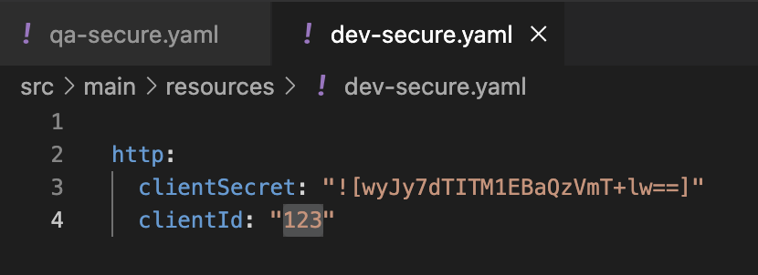
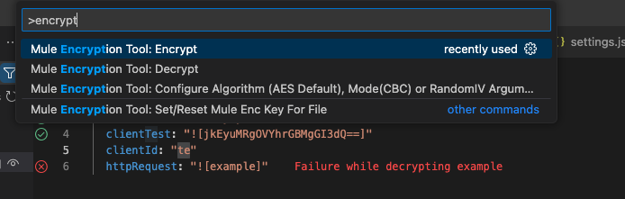
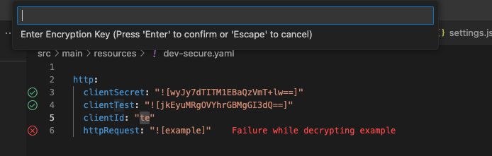
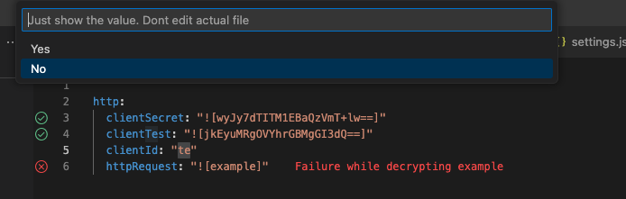
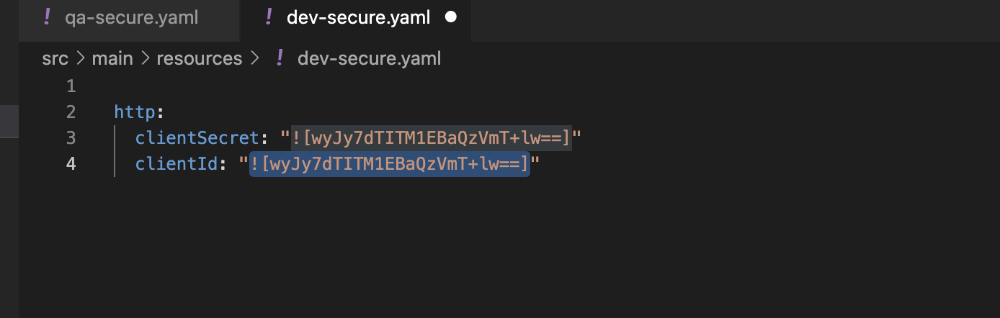
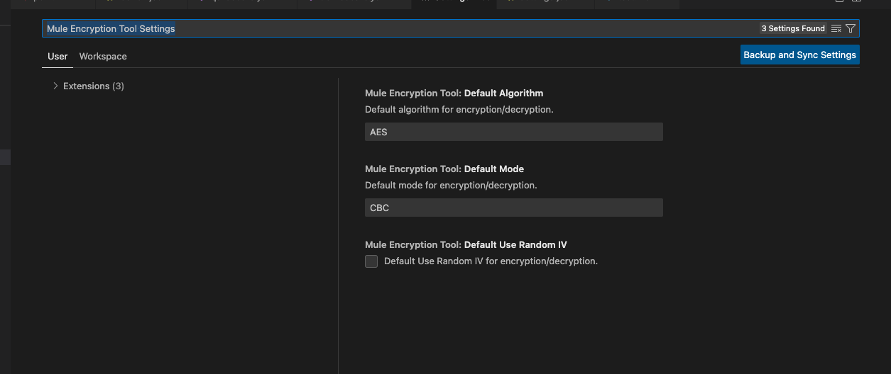
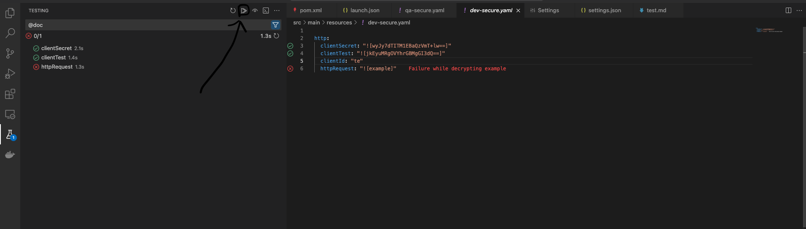

# Mulesoft Encryption Tool

This extension for Visual Studio Code provides a convenient way to encrypt and decrypt values directly within the editor, tailored for Mulesoft applications.

## How To

1. Select text in your YAML file.

   

2. Press "CTRL + SHIFT + P" and type "Mule Encryption Tool: Encrypt" or "Mule Encryption Tool: Decrypt".

   

   NOTE: The encryption file will be stored only while the file is open. After you input to overwrite the key, use the function "Mule Encryption Tool: Encrypt" or "Mule Encryption Tool: Set/Reset Mule Enc Key For File".

   

3. Select if you just want to glance at the value. If not, then select No to insert the value into the file.

   

4. That's it!

   

## Change Default Algorithm, Mode, or ResultIV

1. Press "CTRL + SHIFT + P" and type "Mule Encryption Tool: Encrypt" or "Mule Encryption Tool: Configure Algorithm (AES Default)".

   After that, you will be able to set your project defaults.

   

## Test If All Secure Properties Are Correctly Encrypted Before PROD

1. On the left side, press the Testing icon. In the Testing view, press "Run Tests".

   

## Features

The Mulesoft Encryption Tool includes the following features:

- Encrypt values using Mulesoft's secure encryption standards.
- Decrypt previously encrypted values for easy readability and editing.
- Use the extension's commands directly from the command palette.

## Requirements

Before using this extension, ensure you have Java installed locally.

## Known Issues

No known issues at the moment. If you encounter any problems, please open an issue on the repository's issue tracker.

## Release Notes

Refer to CHANGELOG.md for detailed release notes.

## Report Issues Here

[GITHUB](https://github.com/DasArthur/mulesoft-encryption-tool/issues)